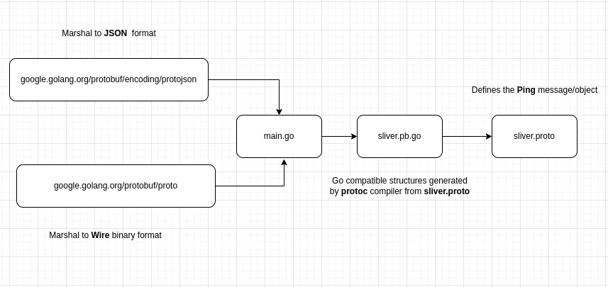

## Mini protobuf example with Go.

### 1. Directory structure.

```sh
.
├── Makefile
├── README.md
├── _static
│   └── 1.png
├── cmd
│   └── main.go
├── go.mod
├── go.sum
└── proto
    ├── sliver.pb.go
    └── sliver.proto

3 directories, 8 files
```



### 2. Setup

```
$ make proto
$ make build
```

### 3. Usage

```
$ ./cmd/main
```

- `ping.json`: json serialized structure

```json
{"Nonce":48879, "Timeout":"2", "BeaconID":"uuid-bot"}
```

- `ping.wire`: wire serialized structure

```sh
$ xxd -g4 ./ping.wire
00000000: 08effd02 10021a08 75756964 2d626f74  ........uuid-bot
```

- `ping.wire.lte`: wire serialized structure little endian

```sh
$ xxd -g4 ./ping.wire.lte
00000000: efbeadde 1337cafe 08effd02 10021a08  .....7..........
00000010: 75756964 2d626f74                    uuid-bot
```

### Perceived benefits of using protobuf
- single source of truth for domain entities throughout the codebase
- provide serializaton/deserializaton for moving data between and client & server or between micro-services.
- transport channel agnostic;
	- serialize payloads could be moved over GRPC
	- http
	- tcp sockets
	- higher customized protocols depending on you.
